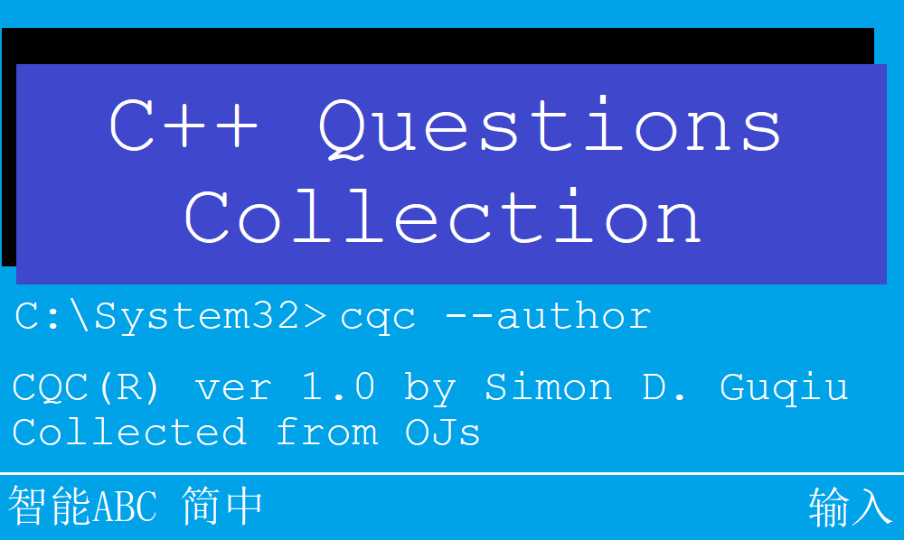

This repo is a collection of some C++ questions which I have studied since 2019.

Most of them came from [Luguo](https://www.luogu.com.cn) and [USACO](https://www.usaco.org). You can search them with the file name, and you can mostly find the question.

Also, as a beginner of OI competitions, I'm NOT sure all answers are correct or the best. So, you can have a look at better answers of the questions, which are included in the question.

Another important fact is that some of the programs is adapted from better answers, instead of mine. But there aren't a lot, and a quote message is included in them.

If you find something wrong in it, it's welcomed to email me at simondguqiu@outlook.com. I'll answer as soon as possible.

Have a nice day. :)